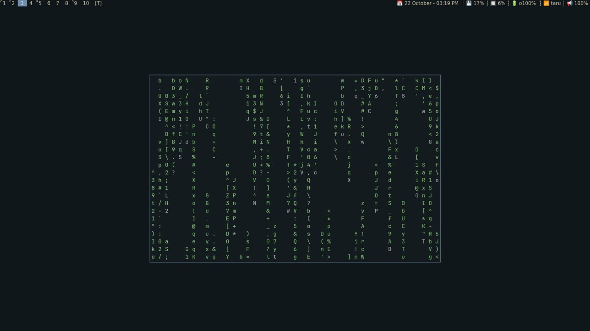

# Dotfiles

This repository contains my dotfiles. I use [GNU Stow](https://www.gnu.org/software/stow/) to manage them.

## Show Case

### DWM and st


### Kitty and Tmux


### Neovim


### File Manager (Yazi)


## Config List

### Not Ignored by stow
- kitty
- nvim
- lvim
- fish
- tmux
- yazi 
- neofetch
- sxhkd
- dwm
- st 
- dmenu
- slstatus
- sioyek

### Ignored by stow
- alacritty
- ranger
- starship
- zsh
- NuShell
- lsd
- felix
- hyprland
- bspwm
- warp
- qutebrowser

## Installation

```bash
git clone https://github.com/ahmedYasserM/.dotfiles.git ~/.dotfiles
cd ~/.dotfiles
```

To install all the dotfiles, run:

```bash
stow .
```

> There some configs that I ignore in `.stow-local-ignore` file, you can check if you need to install them or not.

