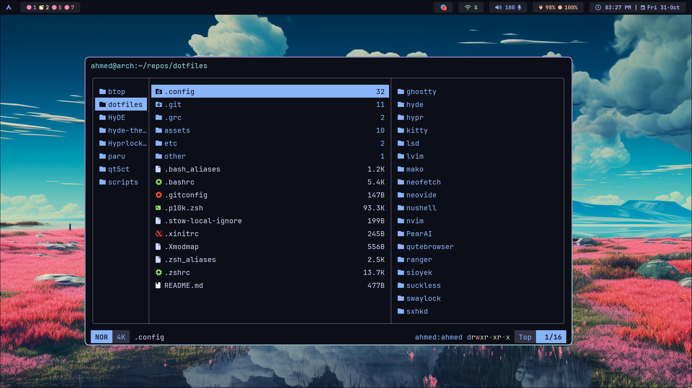

# Dotfiles

## Show Case

### Configs that I use now

- ghostty
- nvim
- fish
- tmux
- yazi
- sioyek
- hyprland
- waybar
- qutebrowser

### Configs that I don't use now

- sxhkd
- dwm
- st
- dmenu
- slstatus
- neofetch
- kitty
- lvim
- alacritty
- ranger
- starship
- zsh
- NuShell
- lsd
- felix
- bspwm
- warp
